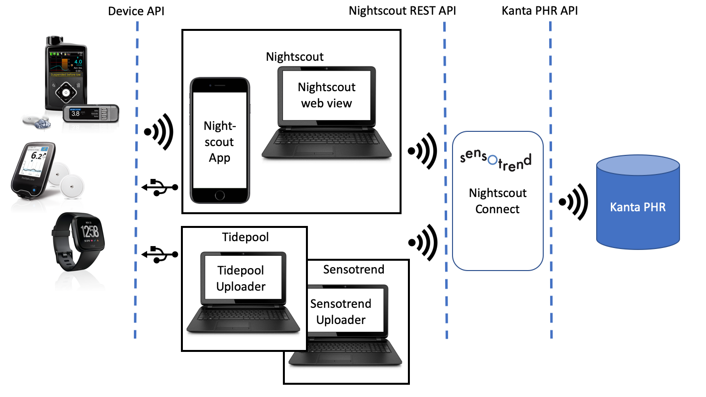

# Nightscout.fi

This repository contains a server that implements several Nightscout Connect functionalities for diabetes related data translation and transfer.

1. Nightscout.fi, a service that allows users to create an account to expose a Nightscout REST API to the Kanta PHR's Omatietovaranto
2. A simplified version of the Tidepool server, which allows users to upload data from their devices to Omatietovaranto using the Tidepool Uploader
3. Nightscout Consent Service, a SMART on FHIR application that implements a consent flow for asking the permission to view a Nightscout instance


# Setting up

* Clone the repository
* Run `npm install` to install dependencies
* Copy my.env.template to my.env and modify the file as needed (the file contains sample configuration values needed by the apps)
* Run `npm run dev` to start both the server and the local dev server for the GUI part.
* Or, run the server only with `npm start`

# Unit tests & code coverage reporting

The repository uses nyc and Mocha to run unit tests found in the /tests. The tests expect to find a Mongo server running on localhost on port 27017 (default) without authentication (`brew tap mongodb/brew && brew install mongodb-community`). Run the tests with `npm test`. Run code coverage report by running `npm run-script coverage`. Get full HTML output with `npm run-script coverage-html`.

# Email features

The codebase uses SendGrid to send email for email verification / consent requests. The SendGrid API key for this purpose is configured in the `SENDGRID_API_KEY` env variable. Email template IDs are currently hardcoded -> to be moved to variables if the account used to send email changes.

If you don't want to use the email registration process, you can search for `site_secret` property in the JSON in the log message produced by the server during the first step of the authentication.

# Authenticating with Kanta PHR

The Kanta PHR sandbox environment requires a test version of the Finnish citizen ID for authentication. The format is DDMMYY-9nnX, where DD is day of month, MM number of month, YY the year, - the separator ('-' for years 1900-1999, 'A' for 2000-2999), 9 an indication of test status, nn freely selectable numbers, and X the checksum. You can use tools like https://www.telepartikkeli.net/tunnusgeneraattori or http://www.lintukoto.net/muut/henkilotunnus/ to easily generate ID's in the right format.

# Testing data flow

* If you want to test things out, especially to see how the Kanta PHR API works, the easiest way is to download and use a Nightscout app like [xDrip+](https://github.com/NightscoutFoundation/xDrip), set it up to upload data to your own installation, and create measurements manually. Note that you can even do this locally on your own computer - just have both your computer and the mobile be connected to the same WLAN and use the computer's IP address. For instance, `https://_3dqGSi8cPfZtzT6hG@localhost:1300/api/v1/` could become `https://_3dqGSi8cPfZtzT6hG@192.168.1.68:1300/api/v1/`. You can enter that URL as the `Base URL` in the `Nightscout Sync (REST-API)` settting in xDrip menu.


You can enter data manually using the syringe icon on the top right corner of the app.


You can enter blood glucose, carbohydrate intake, or insulin dosing data.


After entering a value, you need to confirm the entry by pressing the green plus sign.

If you have a suitable device, you can also use the [Sensotrend Uploader](https://github.com/Sensotrend/sensotrend-uploader) app, or the original Tidepool Uploader (see [below](#using-tidepool-client-with-the-tidepool-server)).

# Using Tidepool Uploader

To run the Tidepool Uploader client:

* Clone the (Tidepool Uploader) https://github.com/tidepool-org/uploader repository
* Use npm as suggested to install dependences (`npm install`)
* Create a new configuration script called `config/local-new.sh` to the config folder based on sample below
* run your script with `source config/local-new.sh` to use the local server
* run the client with `npm run dev`
* Create an account by logging into your nightscout.fi instance
* Log in using the username (email) and password (API secret) you created ^^

Sample file for config

```
export API_URL='http://localhost:1300/tpapi'
export UPLOAD_URL='http://localhost:1300/tpupload'
export DATA_URL='http://localhost:1300/tpdata'
export BLIP_URL='http://localhost:1300/tpblip'
export DEBUG_ERROR=false
export REDUX_LOG=false
export REDUX_DEV_UI=false
```
